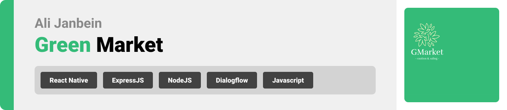

<br><br>

<!-- project philosophy -->
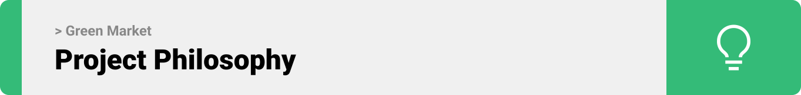

> A mobile app for connecting farmers and customers to sell their products directly, without the need for a middleman. 
>
> Green Market is a great way to support local farmers and get fresh, high-quality produce at a lower price. If you're looking for a more convenient and affordable way to shop for food, then this app is a great option for you.

### User Stories
- As a Farmer, I want to be able to post my production offers, allowing me to sell my products without needing to visit the market physically.
- As a Farmer, I want to participate in auctions, enabling me to obtain the best price for my products.
- As a customer, I want to search for available products to purchase, so that I can choose the best quality and price.

### Admin Stories
- As an admin, I want to have access to a complete user list, enabling me to ban users based on reported incidents, thus helping me maintain control over the app.
- As an Admin, I want to have the capability to upload and display images for product offers, as it will enhance the marketing aspect within the app.
- As an admin, I want to be able to view a list of all users and have the ability to delete a user or access their information as needed.


<br><br>

<!-- Prototyping -->
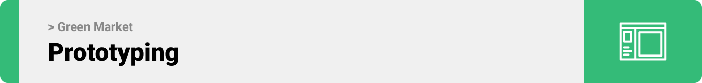

> We designed Green Market using wireframes and mockups, iterating on the design until we reached the ideal layout for easy navigation and a seamless user experience.

### Wireframes
| Home screen  | Profile screen |  AddPost screen |
| ---| ---| ---|
| .png) | .png) | 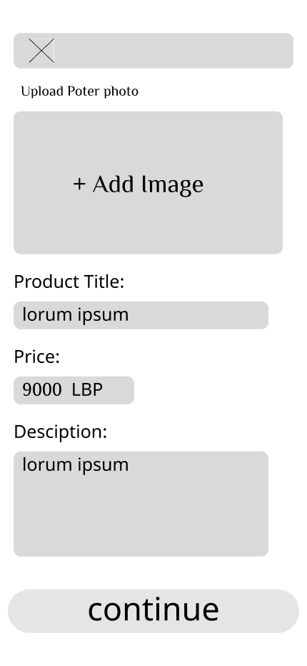 |

### Mockups
| Complete Profile screen  | Login Screen | Auction Screen |
| ---| ---| ---|
| 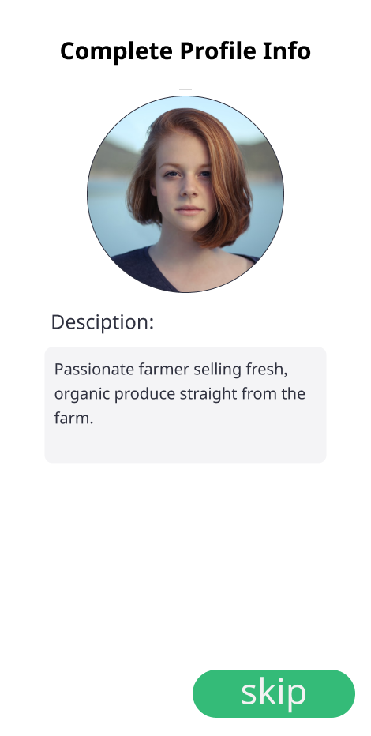 | 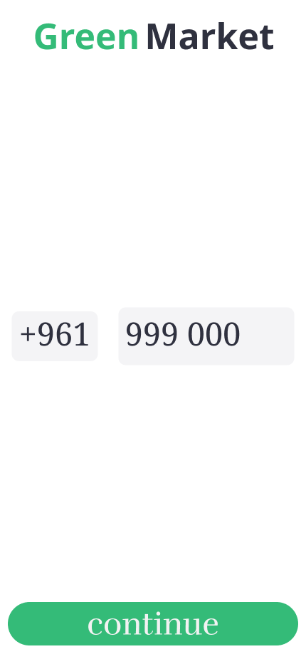 | 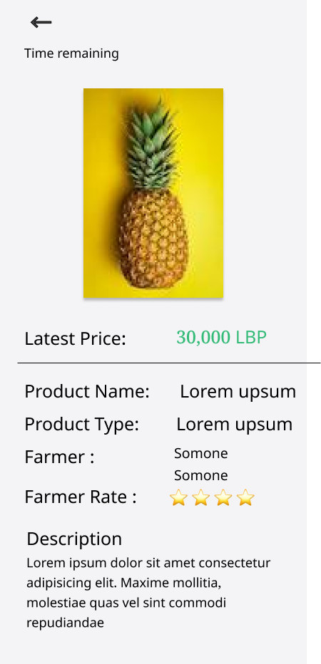 |

<br><br>

<!-- Implementation -->
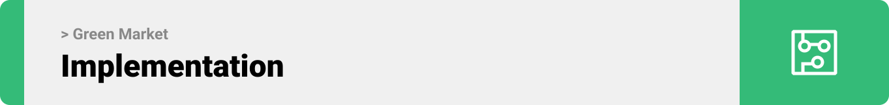

> Using the wireframes and mockups as a guide, we implemented the Green Market app with the following features:

### User Screens (Mobile)
| Welcome screen  | Login screen | Verification screen | Register screen |
| ---| ---| ---| ---|
| 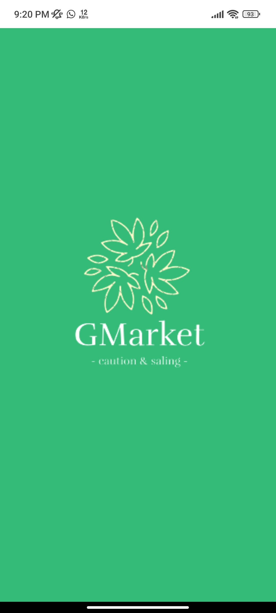 | 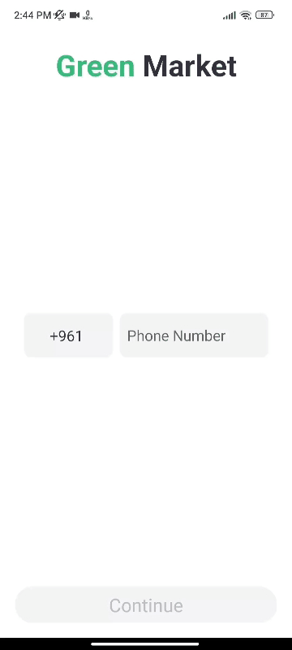 | 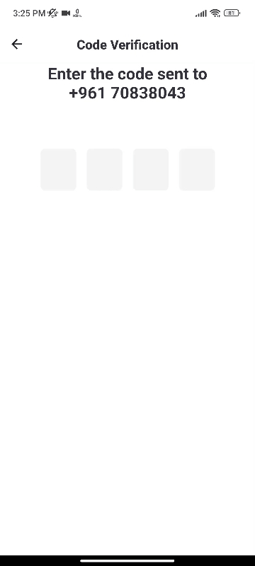 | 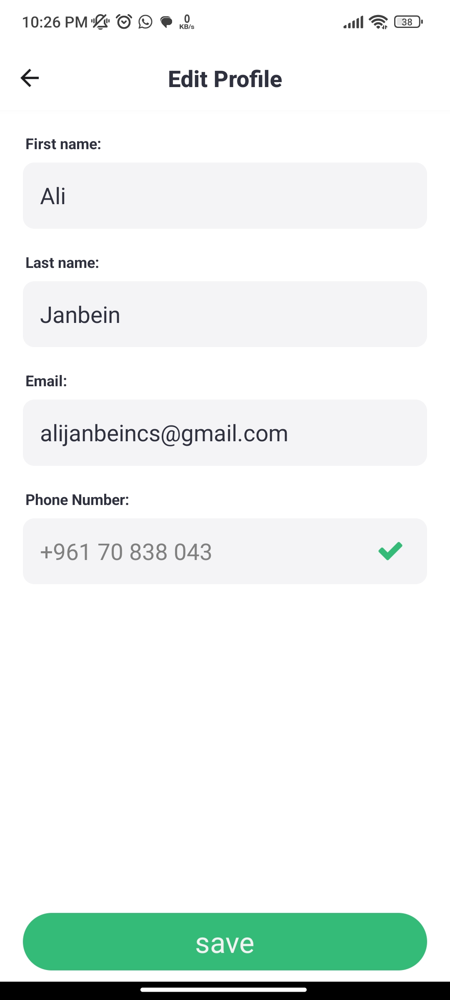 |
| Home screen  | Auction Screen | Profile Screen | Messages Screen |
|  | 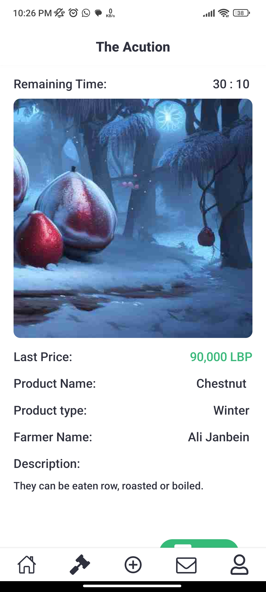 | 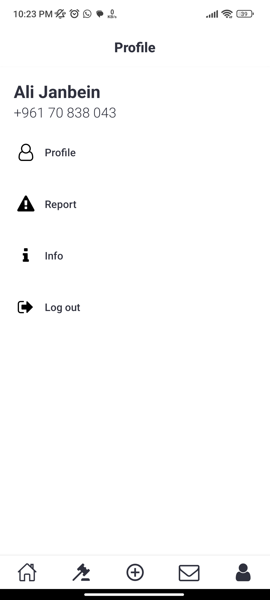 | 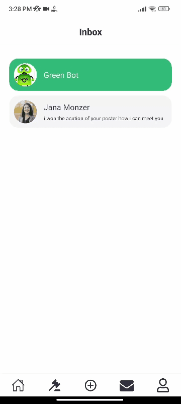 |
| Search screen  | AddPost Screen | Report Screen | Categories Screen |
| 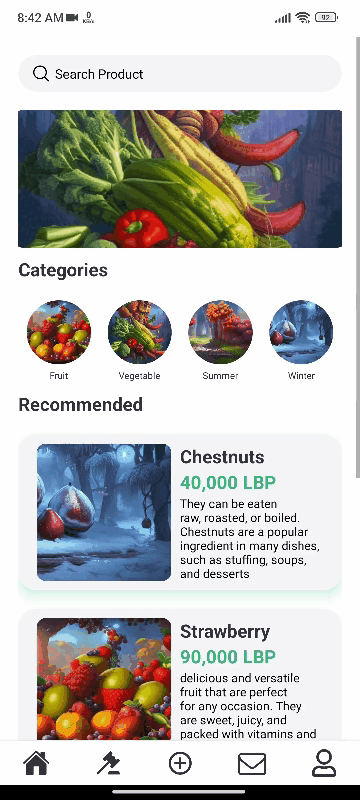 | 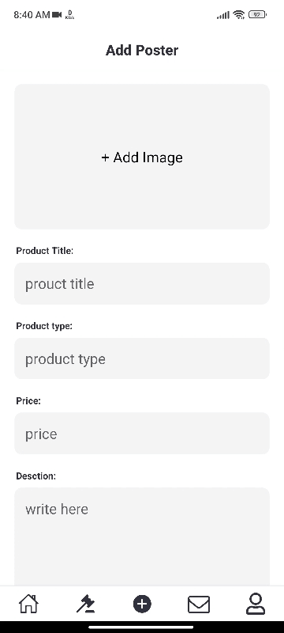 | 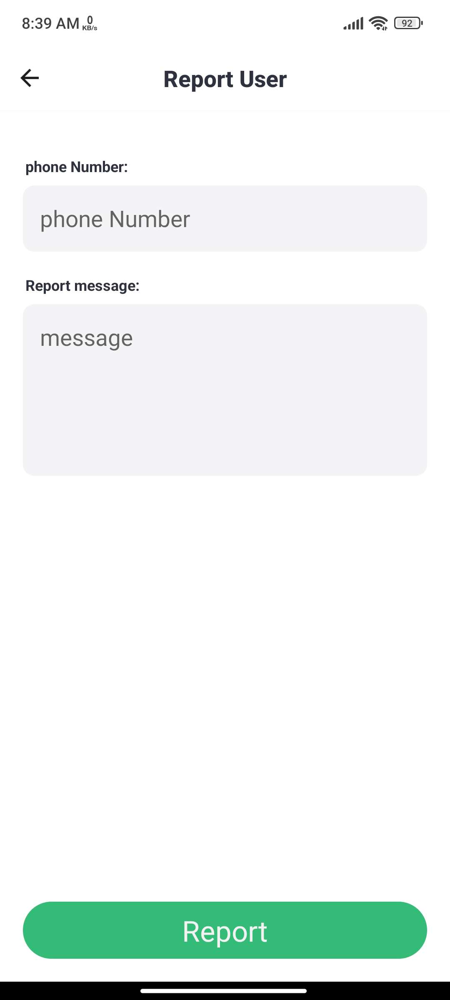 | 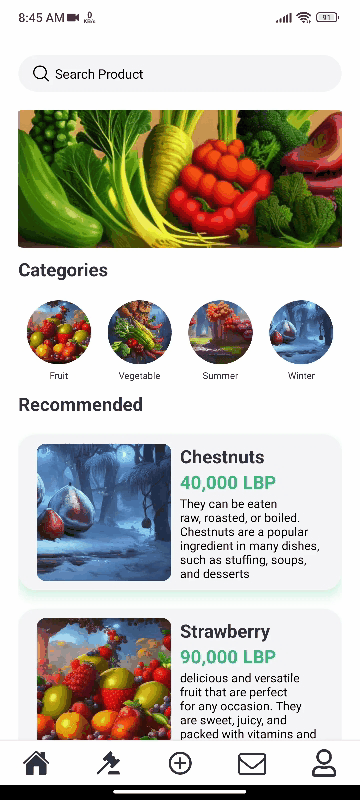 |


### Admin Screens (Web)
| Login screen  | Dashboard screen |  Reports screen |
| ---| ---| ---|
| 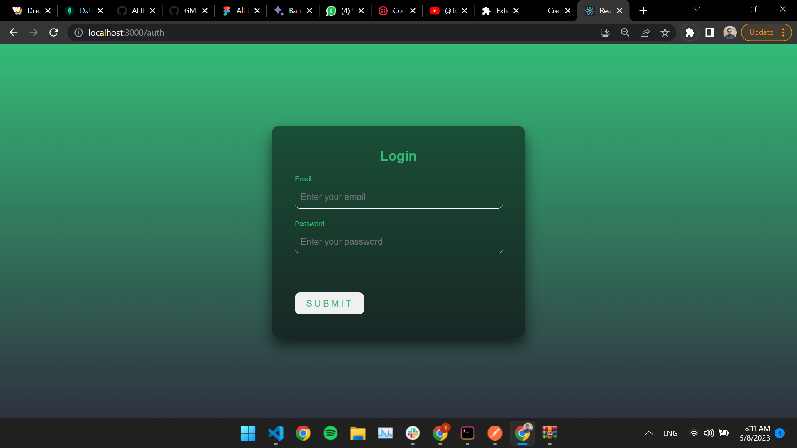 | 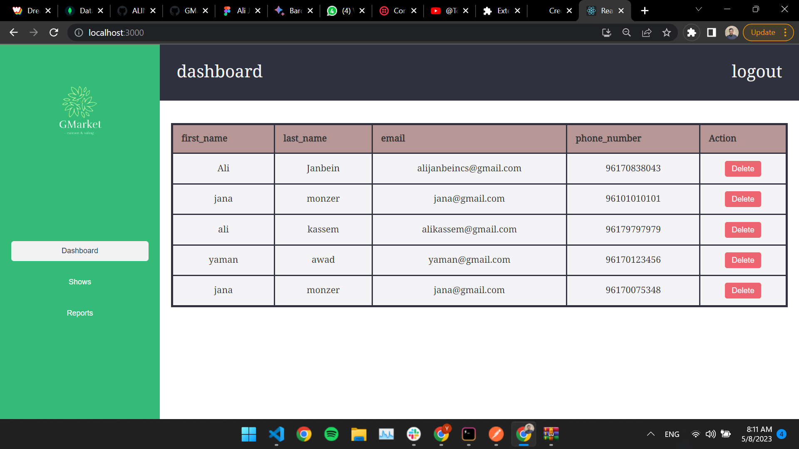 | 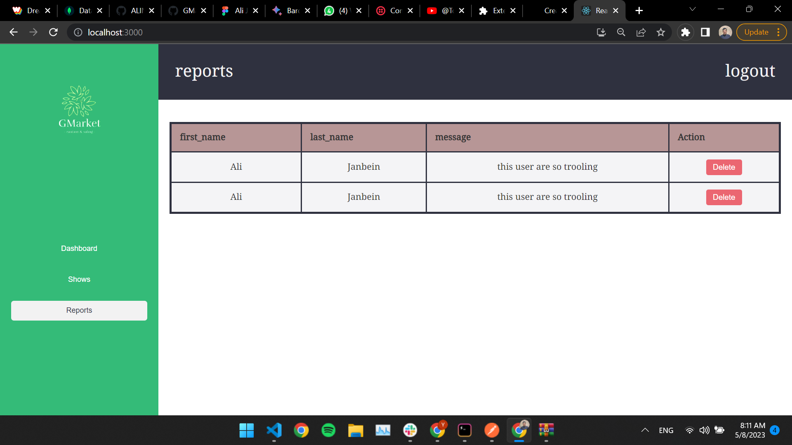 |
<!-- | Home screen  | Menu Screen | Order Screen |
|  |  |  | -->

<br><br>

<!-- Tech stack -->
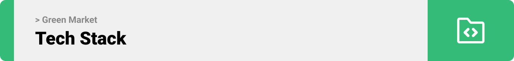

###  Green Market is built using the following technologies:

- This project uses the [React Native framework](https://reactnative.dev/). React Native apps can be built for multiple platforms, including Android, iOS, macOS, tvOS, Web, Windows and UWP. 
- For persistent storage (database), the app uses the [mongodb](https://www.mongodb.com/)  which allows the app to store all data in different schema 
and handler the big data insid the app
- To send SMS verification code, the app uses the [TWILIO](https://www.twilio.com/) Feature which allow the app to send messages via user phone number
  - 🚨 Currently, chatbot isn't helpfull because he is still learning. This is a known issue that we are working to resolve!
- The app uses the font ["Noto Serif Tamil"](https://fonts.google.com/noto/specimen/Noto+Serif?query=not+serif+tamil) as its main font, and the design of the app adheres to the material design guidelines.

<br><br>

<!-- How to run -->


> To set up Green Market locally, follow these steps:

### Prerequisites

This is an example of how to list things you need to use the software and how to install them.
* npm
  ```sh
  npm install npm@latest -g
  ```

### Installation

_Below is an example of how you can instruct your audience on installing and setting up your app. This template doesn't rely on any external dependencies or services._

1. Get a free API Key at [https://example.com](https://example.com)
2. Clone the repo
   ```sh
   git clone https://github.com/ALINJFSw/GMarket.git
   ```
3. Install NPM packages
   ```sh
   npm install
   ```
4. Enter your API in `constant.js`
   ```js
   const API_KEY = 'ENTER YOUR API';
   ```

Now, you should be able to run Green Market locally and explore its features.